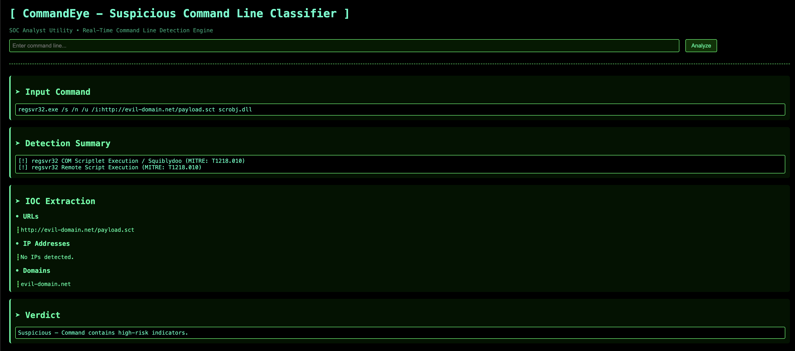

# CommandEye — Command Line Classifier & IOC Extraction Tool

**A SOC-grade web application for analyzing command lines, detecting malicious behavior, extracting IOCs, mapping activity to MITRE ATT&CK, and presenting results in a sleek, hacker-themed interface.**



---

## Features

CommandEye performs deep analysis of any command line with:

### Multi-rule Detection Engine

Detects a wide range of suspicious patterns, including:

* **PowerShell abuse:** IEX, encoded commands, bypass, hidden windows, fileless execution
* **LOLBin abuse:** rundll32, regsvr32, mshta, wmic, bitsadmin, certutil
* **Obfuscation techniques:** Base64, FromBase64String, XOR, gzipstream
* **Persistence mechanisms:** Run keys, scheduled tasks, services, WMI
* **Script interpreters:** cscript, wscript, mshta, python, powershell, VBS, JS
* **Lateral movement tools:** PsExec, SSH, WMI exec
* **Download/remote execution:** curl, wget, certutil
* **Suspicious execution sources:** Temp/AppData EXEs, direct cmd.exe launch
* **Process tampering & defense evasion signals**

> Each detection is mapped to **MITRE ATT&CK** and a **Detection Family** for verdict logic.

---

## IOC Extraction

CommandEye automatically extracts:

* URLs
* Domains
* IP addresses
* Email addresses
* File paths

> URLs are hashed for **VirusTotal URL lookup**, while domains & IPs generate VT pivot links.

---

## Contextual Verdict Engine

Verdicts dynamically reflect *what was actually detected*, e.g.:

```
[Suspicious]
Suspicious PowerShell behavior detected
Obfuscated content found
Indicators of persistence detected
Possible attempts to evade defenses
```

> The more triggers, the more detailed the verdict.

---

## UI Features

* Clean dual-panel layout
* Matrix-themed neon cyber style
* Smooth hover animations on VirusTotal buttons
* Clear spacing & visual grouping of findings
* Fully responsive layout

---

## Project Structure

```
commandeye/
│
├── app.py              # Flask app routing + backend logic
├── classifier.py       # Detection engine & verdict builder
├── rules.py            # Full detection dictionary (families, MITRE, descriptions)
├── ioc_extractor.py    # URL/IP/Domain/File/Email IOC extraction
│
├── templates/
│   └── index.html      # Frontend HTML
│
├── static/
│   └── styles.css      # CSS
│
└── README.md          
```

---

## Installation

Clone the repository:

```
git clone https://github.com/coreylynch00/commandeye.git
cd commandeye
```

(Optional) Create a virtual environment:

```
python3 -m venv venv
source venv/bin/activate        # macOS/Linux
venv\Scripts\activate           # Windows
```

Install dependencies:

```
pip install Flask
```

### Running CommandEye

Start the web app:

```
python3 app.py
```

Open in your browser:

```
http://127.0.0.1:5000/
```

Enter any command line, click **Analyze**, and instantly receive:

* Detection Summary
* MITRE ATT&CK Mapping
* IOC Extraction
* Verdict
* VirusTotal lookups

---
